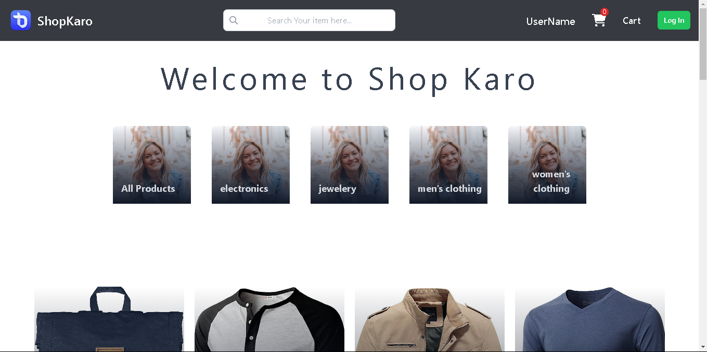
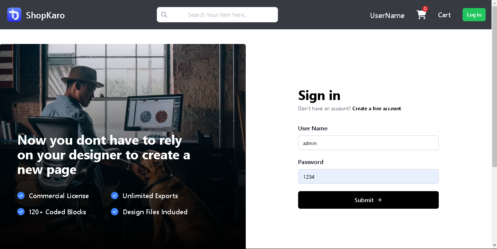
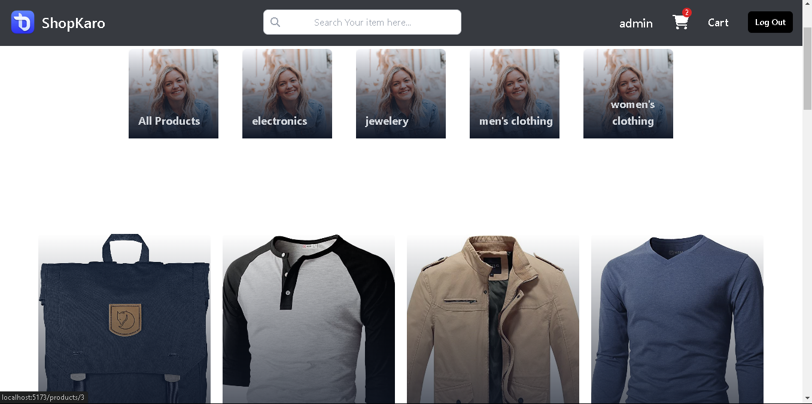
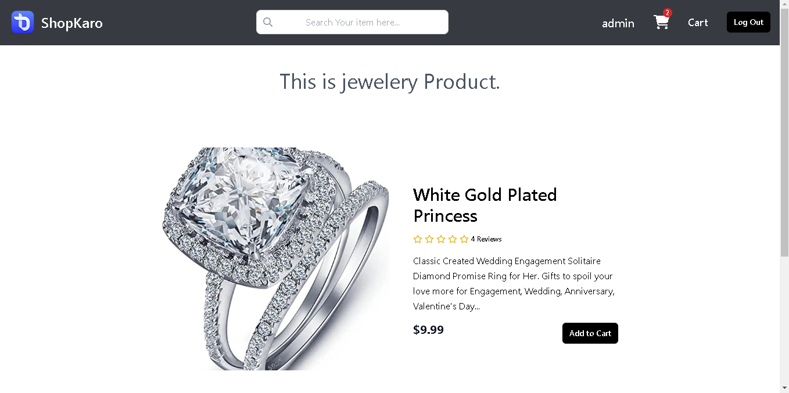
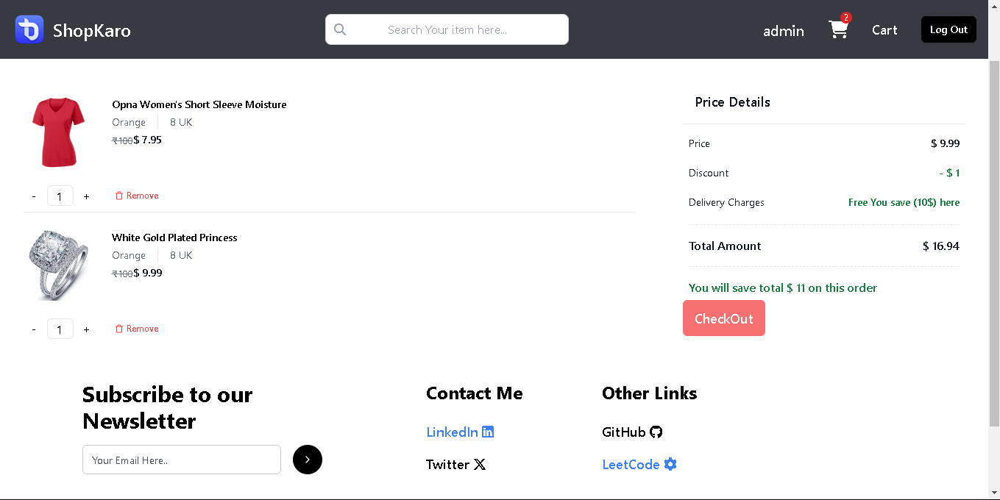
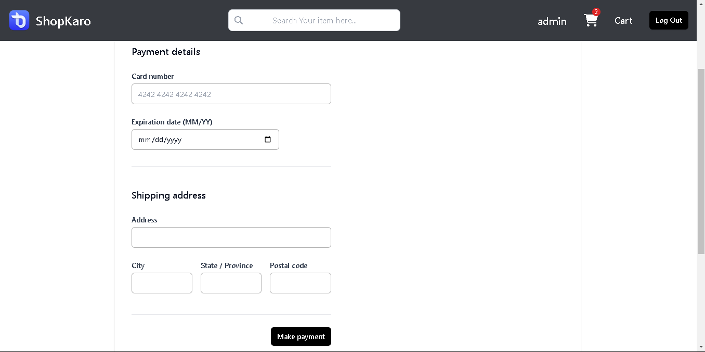
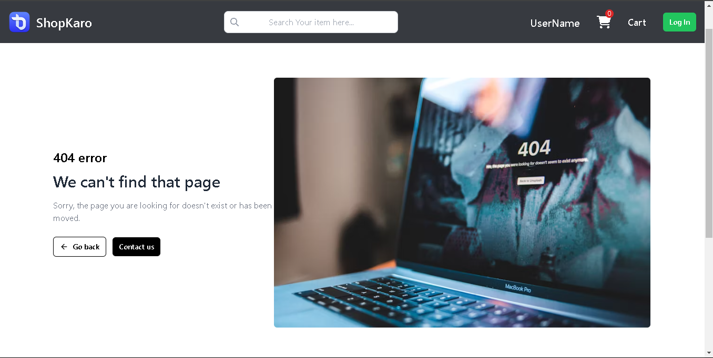

# E-Commerce 

I created this whole app using react vite for frontend and tailwind css for it's UI. And it is moblie responnsive as well.

I used the fakestore.api for backend after adding crud operations within it. I deploy it on render.

I implemented contex for state management and useCookie for jwt-authentication. 

## Project Demo Link

https://vishnuecommerceapp.netlify.app/

If You face any problem to open the deploy whole project. You can refer this link. 

https://youtu.be/Saqi-61mgE4?si=_TLZL7XXVmU5sPxO
## Screenshots

## Screenshots

## Learning

- Authentication
- Use Case of Context 
- Custom Hooks
- Use case of Life cycle methods
- Eager Loading and Lazy Loading
- Routing for SPA
- Modularize Code
- Manage Folder Structure
- Deployment (Frontend and Backend)
- Shimmer UI
- React Hot Toast (NPM)

## Key Point to better Experience.
- If You are using on mobile make sure you have a strong bandwith internet connection.
- For Demo Purpose Use
- Username:- admin
- Password:- 1234
- If you don't want to use the default Username and Password. You can signup.
- Don't use more letters for searching. Because data are limited.
- If you increase the quantity price will not reflect on the total ammount. Because quantity is fixed from server side.
- I have handled error page In case someone try to hits wrong url.
- Dont Put original Card Credentials for the final payment.

